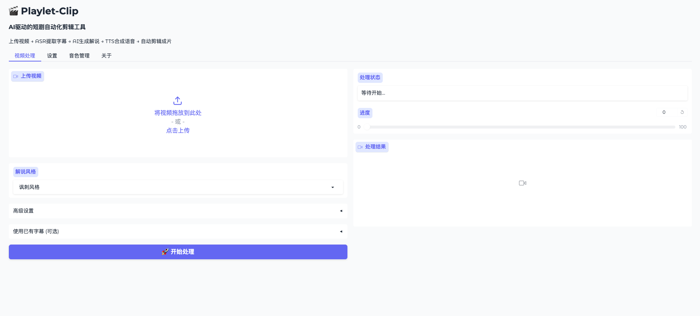

# Playlet-Clip 短剧自动化剪辑工具 v2.0

<p align="center">
  
  
  
  
</p>

AI驱动的短剧自动化剪辑工具，能够根据原始视频自动生成带有解说的短视频。

## ✨ 功能特点

- 🎤 **ASR语音识别**: 使用 FunASR 自动提取视频字幕，无需手动准备 SRT 文件
- 🤖 **AI解说生成**: 使用 ChatGPT 根据字幕内容和指定风格自动生成解说文案
- 🔊 **TTS语音合成**: 支持 CosyVoice（本地）和 Edge-TTS（云端）两种方案
- 🎬 **视频智能剪辑**: 自动截取视频片段，添加解说音频、字幕、模糊效果
- 🎚️ **音频混合**: 解说时保留原声（可调节音量），非解说时完整保留原音
- 🖥️ **Web界面**: 基于 Gradio 的友好 Web 操作界面
- 🐳 **Docker部署**: 支持 Docker Compose 一键部署

## 🔧 技术栈

| 组件 | 技术 | 说明 |
|------|------|------|
| 语言 | Python 3.10+ | - |
| 包管理 | [uv](https://github.com/astral-sh/uv) | 现代 Python 包管理器 |
| ASR | FunASR | 阿里开源，支持离线识别 |
| TTS | CosyVoice / Edge-TTS | 本地部署 / 云端服务 |
| LLM | OpenAI API | ChatGPT |
| 视频处理 | FFmpeg | - |
| Web UI | Gradio | - |

---

## 📦 安装指南

### 前置要求

- Python 3.10+
- FFmpeg（必须）
- NVIDIA GPU + CUDA（推荐，用于加速 ASR/TTS）

### 方式一：零基础用户（Docker 部署）

最简单的方式，只需要安装 Docker 即可。

#### 1. 安装 Docker

**macOS:**
```bash
brew install --cask docker
# 或下载 Docker Desktop: https://www.docker.com/products/docker-desktop/
```

**Ubuntu/Debian:**
```bash
curl -fsSL https://get.docker.com | sh
sudo usermod -aG docker $USER
# 注销后重新登录
```

**Windows:**
下载安装 [Docker Desktop](https://www.docker.com/products/docker-desktop/)

#### 2. 克隆项目

```bash
git clone https://github.com/Anning01/playlet-clip.git
cd playlet-clip
```

#### 3. 配置环境变量

```bash
cp .env.example .env
```

编辑 `.env` 文件，填写必要配置：
```env
OPENAI_API_KEY=sk-your-api-key-here
OPENAI_BASE_URL=https://api.openai.com/v1  # 可选，支持代理
```

#### 4. 启动服务

```bash
cd docker

# GPU 版本（推荐，需要 NVIDIA GPU）
docker-compose up -d

# CPU 版本（无需 GPU，但速度较慢）
docker-compose -f docker-compose.cpu.yml up -d
```

#### 5. 访问

打开浏览器访问 http://localhost:7860

---

### 方式二：开发者安装（本地开发）

适合需要修改代码或进行二次开发的用户。

#### 1. 安装 uv

```bash
# macOS / Linux
curl -LsSf https://astral.sh/uv/install.sh | sh

# Windows (PowerShell)
powershell -c "irm https://astral.sh/uv/install.ps1 | iex"

# 或使用 pip
pip install uv
```

#### 2. 安装 FFmpeg

```bash
# macOS
brew install ffmpeg

# Ubuntu/Debian
sudo apt-get install ffmpeg

# Windows (使用 Chocolatey)
choco install ffmpeg
```

#### 3. 克隆并安装依赖

```bash
git clone https://github.com/Anning01/playlet-clip.git
cd playlet-clip

# 安装项目依赖
uv sync
```

#### 4. 配置

```bash
cp config/config.example.yaml config/config.yaml
```

编辑 `config/config.yaml`，填写必要配置（至少需要 `llm.api_key`）。

#### 5. 安装 CosyVoice（可选，推荐）

如果需要使用本地 TTS（更自然的语音），运行：

```bash
./scripts/install_cosyvoice.sh

# 设置环境变量
source setup_cosyvoice_env.sh
```

> 如果不安装 CosyVoice，系统会自动使用 Edge-TTS（云端服务，需要网络）

#### 6. 运行

```bash
# 启动 Web 界面
uv run python -m playlet_clip.main

# 或运行测试
uv run pytest tests/ -v
```

---

## 🚀 使用方法

### Web 界面

1. 打开浏览器访问 http://localhost:7860
2. 上传视频文件
3. 选择解说风格
4. （可选）调整高级设置
5. 点击"开始处理"
6. 等待处理完成后预览和下载




### 命令行 API

```python
import asyncio
from pathlib import Path
from playlet_clip.core.config import get_settings
from playlet_clip.core.pipeline import PlayletPipeline

async def main():
    settings = get_settings()
    pipeline = PlayletPipeline(settings)

    result = await pipeline.process(
        video_path=Path("data/input/video.mp4"),
        style="讽刺风格",
        output_path=Path("data/output/result.mp4"),
    )

    if result.success:
        print(f"处理完成: {result.output_path}")
        print(f"耗时: {result.duration:.2f}s")
    else:
        print(f"处理失败: {result.error_message}")

asyncio.run(main())
```

### 使用现有字幕

如果已有 SRT 字幕文件，可以跳过 ASR 步骤：

```python
result = await pipeline.process_with_existing_subtitles(
    video_path=Path("video.mp4"),
    srt_path=Path("subtitles.srt"),
    style="温情风格",
)
```

---

## 📁 项目结构

```
playlet-clip/
├── pyproject.toml              # 项目配置和依赖
├── uv.lock                     # 依赖锁定文件
├── README.md                   # 本文档
│
├── src/playlet_clip/           # 源代码
│   ├── __init__.py
│   ├── main.py                 # 应用入口
│   │
│   ├── core/                   # 核心模块
│   │   ├── config.py           # 配置管理 (pydantic-settings)
│   │   ├── pipeline.py         # 主处理管道
│   │   └── exceptions.py       # 自定义异常
│   │
│   ├── services/               # 服务层
│   │   ├── asr.py              # ASR 服务 (FunASR)
│   │   ├── tts.py              # TTS 服务 (CosyVoice/Edge-TTS)
│   │   ├── llm.py              # LLM 服务 (OpenAI)
│   │   └── video.py            # 视频处理服务
│   │
│   ├── models/                 # 数据模型
│   │   ├── subtitle.py         # 字幕数据结构
│   │   ├── segment.py          # 片段数据结构
│   │   └── task.py             # 任务状态模型
│   │
│   ├── utils/                  # 工具函数
│   │   ├── ffmpeg.py           # FFmpeg 命令封装
│   │   ├── srt.py              # SRT 文件处理
│   │   └── time.py             # 时间计算工具
│   │
│   └── ui/                     # Gradio 界面
│       ├── app.py              # Gradio 应用主入口
│       ├── components/         # UI 组件
│       └── handlers/           # 事件处理
│
├── config/                     # 配置目录
│   ├── config.example.yaml     # 配置示例
│   └── prompts/
│       └── narrator.txt        # 解说生成提示词模板
│
├── docker/                     # Docker 配置
│   ├── Dockerfile              # GPU 版本镜像
│   ├── Dockerfile.cpu          # CPU 版本镜像
│   └── docker-compose.yml      # 编排配置
│
├── scripts/                    # 脚本工具
│   ├── install_cosyvoice.sh    # CosyVoice 安装脚本
│   └── run_tests.sh            # 测试运行脚本
│
├── data/                       # 数据目录
│   ├── input/                  # 输入文件
│   ├── output/                 # 输出文件
│   └── temp/                   # 临时文件
│
├── pretrained_models/          # AI 模型文件（自动下载）
│
└── tests/                      # 测试用例
    ├── test_01_asr.py          # ASR 测试
    ├── test_02_tts.py          # TTS 测试
    ├── test_03_llm.py          # LLM 测试
    ├── test_04_video.py        # 视频处理测试
    ├── test_05_pipeline.py     # 完整流程测试
    └── test_06_editing.py      # 剪辑逻辑测试
```

---

## ⚙️ 配置说明

### 环境变量

| 变量 | 说明 | 必填 | 默认值 |
|------|------|------|--------|
| `OPENAI_API_KEY` | OpenAI API 密钥 | ✅ | - |
| `OPENAI_BASE_URL` | API 基础 URL（支持代理） | ❌ | https://api.openai.com/v1 |
| `PLAYLET__DEBUG` | 调试模式 | ❌ | false |
| `PLAYLET__UI_PORT` | Web 端口 | ❌ | 7860 |

### 配置文件 (config/config.yaml)

```yaml
# LLM 配置
llm:
  api_key: "sk-xxx"              # 必填
  base_url: "https://api.openai.com/v1"
  model: "gpt-4o"
  temperature: 0.3

# TTS 配置
tts:
  backend: "auto"                # auto / cosyvoice_local / edge_tts
  default_voice: "中文女"
  speed: 1.0

# 视频处理
video:
  blur_height: 185               # 模糊区域高度
  blur_y: 1413                   # 模糊区域 Y 坐标
  subtitle_margin: 65            # 字幕边距
  original_volume: 0.3           # 解说时原声音量 (0-1)
  narration_volume: 1.0          # 解说音量 (0-2)

# 解说风格
styles:
  - name: "讽刺风格"
    description: "通过讽刺和夸张的手法来评论剧中的不合理或过于狗血的情节"
```

详见 `config/config.example.yaml`

---

## 🎨 解说风格

内置以下解说风格：

| 风格 | 说明 |
|------|------|
| 讽刺风格 | 通过讽刺和夸张的手法来评论剧中的不合理或过于狗血的情节 |
| 温情风格 | 以温和、感性的语气解读剧情，引发观众共鸣 |
| 悬疑风格 | 以悬疑、紧张的语气解读剧情，制造悬念感 |
| 吐槽风格 | 以轻松幽默的方式吐槽剧情中的槽点 |
| 专业风格 | 以专业、客观的角度分析剧情 |

可在配置文件中自定义更多风格，并支持自定义提示词模板。

---

## 🔊 TTS 音色

### CosyVoice 预设音色
- 中文女、中文男
- 日语男、韩语女
- 粤语女
- 英文女、英文男

### Edge-TTS
- 支持更多语言和音色
- 无需本地模型，但需要网络连接

---

## 📋 系统要求

| 配置项 | 最低要求 | 推荐配置 |
|--------|----------|----------|
| CPU | 4 核 | 8 核+ |
| 内存 | 8GB | 16GB+ |
| GPU | 无 | NVIDIA 8GB+ VRAM |
| 存储 | 20GB | 50GB+ |
| 系统 | Linux/macOS/Windows | Linux |

---

## 🗺️ 开发计划 (Roadmap)

### v2.1 - 智能场景分析

- [ ] **场景检测**: 集成 [PySceneDetect](https://github.com/Breakthrough/PySceneDetect) 进行镜头边界检测
- [ ] **视觉标签**: 通过视觉大模型（GPT-4V / Qwen-VL）为每个镜头生成描述标签
- [ ] **智能重组**: 使用 LLM 根据场景标签重新编排镜头顺序，优化叙事结构

### v2.2 - 多角色识别

- [ ] **说话人分离**: 使用 [CAM++](https://modelscope.cn/models/iic/speech_campplus_sv_zh-cn_16k-common/summary) 进行说话人特征提取
- [ ] **角色识别**: 基于 [Paraformer-zh](https://modelscope.cn/models/iic/speech_paraformer-large-vad-punc_asr_nat-zh-cn-16k-common-vocab8404-pytorch) 最新版实现多人声分离
- [ ] **角色标注**: 自动识别并标注不同说话人（如：男主、女主、配角A）

### v2.3 - 音频增强

- [ ] **BGM 智能配乐**: 根据场景情绪自动匹配背景音乐
- [ ] **音频分离**: 分离人声、背景音、音效
- [ ] **动态混音**: 根据场景自动调整音量平衡

### v2.4 - 高级功能

- [ ] **批量处理**: 支持多视频队列处理
- [ ] **模板系统**: 可保存和复用剪辑模板
- [ ] **实时预览**: 处理过程中实时预览效果
- [ ] **云端部署**: 支持云服务器分布式处理

---

## 🧪 测试

```bash
# 运行所有测试
uv run pytest tests/ -v

# 运行特定测试
uv run pytest tests/test_02_tts.py -v -s

# 使用测试脚本
./scripts/run_tests.sh all     # 所有测试
./scripts/run_tests.sh asr     # ASR 测试
./scripts/run_tests.sh tts     # TTS 测试
./scripts/run_tests.sh llm     # LLM 测试
./scripts/run_tests.sh video   # 视频测试
```

---

## 🐳 Docker 构建

### 本地构建镜像

```bash
cd docker

# GPU 版本
docker build -t playlet-clip:gpu -f Dockerfile ..

# CPU 版本
docker build -t playlet-clip:cpu -f Dockerfile.cpu ..
```

### 自定义配置

```bash
# 挂载自定义配置
docker run -d \
  -p 7860:7860 \
  -v $(pwd)/config:/app/config \
  -v $(pwd)/data:/app/data \
  -e OPENAI_API_KEY=sk-xxx \
  playlet-clip:gpu
```

---

## 🤝 贡献

欢迎提交 Issue 和 Pull Request！

1. Fork 本仓库
2. 创建特性分支 (`git checkout -b feature/amazing-feature`)
3. 提交更改 (`git commit -m 'Add amazing feature'`)
4. 推送到分支 (`git push origin feature/amazing-feature`)
5. 创建 Pull Request

---

## 📄 许可证

[MIT License](LICENSE)

---

## 👤 作者

- anning (anningforchina@gmail.com)

---

## 🙏 致谢

- [FunASR](https://github.com/alibaba-damo-academy/FunASR) - 阿里达摩院语音识别
- [CosyVoice](https://github.com/FunAudioLLM/CosyVoice) - 阿里语音合成
- [Edge-TTS](https://github.com/rany2/edge-tts) - 微软语音合成
- [Gradio](https://gradio.app/) - Web 界面框架
- [PySceneDetect](https://github.com/Breakthrough/PySceneDetect) - 场景检测（计划集成）
